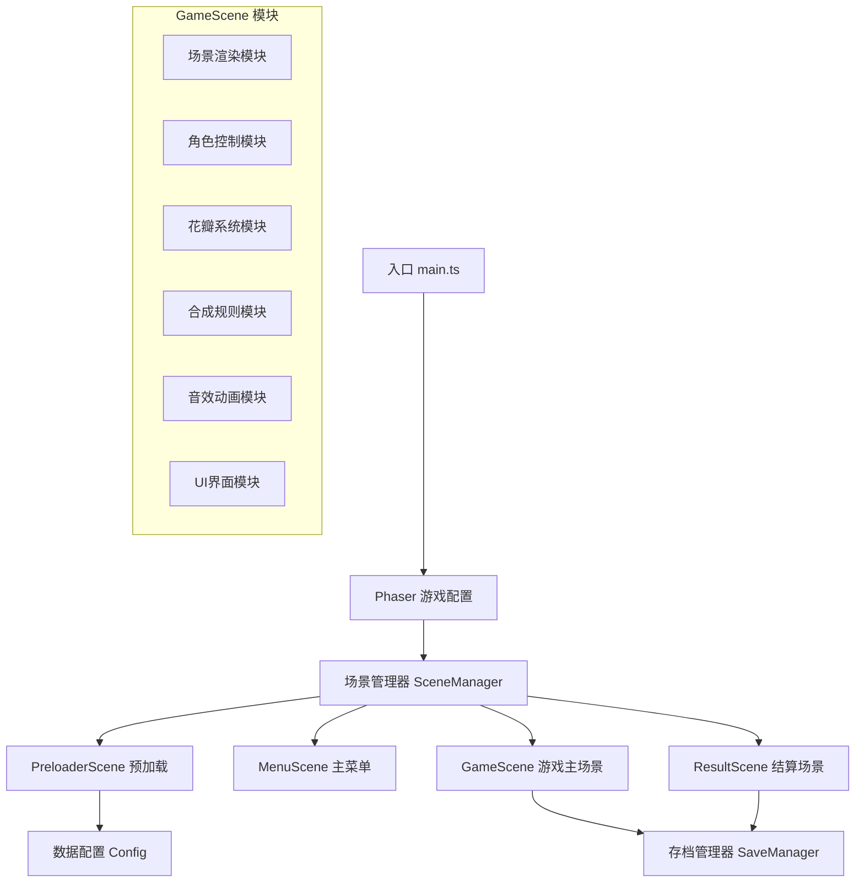

## 1. 架构设计



## 2. 技术描述

- **前端框架**：Vite 6.5.0 + TypeScript 5.0
- **游戏引擎**：Phaser 3.80.0
- **状态管理**：Phaser Events 事件系统 + 自定义 GameState
- **数据持久化**：LocalStorage
- **音频系统**：Web Audio API (Phaser Sound)
- **图形渲染**：Canvas 2D + WebGL 自动切换

## 3. 目录结构

```
src/
├── main.ts                 # 游戏入口
├── types/                  # 类型定义
│   └── index.ts
├── config/                 # 游戏配置
│   └── GameConfig.ts
├── scenes/                 # Phaser 场景
│   ├── PreloaderScene.ts   # 资源预加载
│   ├── MenuScene.ts        # 主菜单
│   ├── GameScene.ts        # 游戏主场景
│   └── ResultScene.ts      # 结算场景
├── modules/                # 游戏模块
│   ├── SceneRenderer.ts    # 场景渲染模块
│   ├── PlayerController.ts # 角色控制模块
│   ├── PetalSystem.ts      # 花瓣系统模块
│   ├── SynthesisSystem.ts  # 合成规则模块
│   ├── AudioManager.ts     # 音效动画模块
│   └── UIManager.ts        # UI界面模块
├── managers/               # 管理器
│   ├── SaveManager.ts      # 存档管理器
│   └── EventManager.ts     # 事件管理器
└── assets/                 # 资源目录
    ├── images/             # 图片资源
    ├── audio/              # 音频资源
    └── data/               # 配置数据
```

## 4. 场景定义

| 场景名称 | 场景键 | 主要职责 |
|----------|--------|----------|
| PreloaderScene | Preloader | 加载所有游戏资源，显示加载进度 |
| MenuScene | Menu | 显示主菜单，处理开始/继续游戏 |
| GameScene | Game | 核心游戏逻辑，探索、收集、合成 |
| ResultScene | Result | 显示通关动画和游戏统计 |

## 5. 核心数据模型

### 5.1 游戏状态 (GameState)
```typescript
interface GameState {
  playerX: number;
  playerY: number;
  petals: Record<PetalType, number>;
  unlockedPetals: PetalType[];
  totalCollected: number;
  totalSynthesized: number;
  playTime: number;
  isCompleted: boolean;
  hasWakeUp: boolean;
}
```

### 5.2 花瓣类型 (PetalType)
```typescript
enum PetalType {
  MOONLIGHT = 'moonlight',      // 月光花瓣 (等级1)
  STARLIGHT = 'starlight',      // 星光花瓣 (等级1)
  DEW = 'dew',                  // 露珠花瓣 (等级1)
  GLOWING = 'glowing',          // 荧光花瓣 (等级2)
  DREAM = 'dream',              // 梦境花瓣 (等级2)
  ETERNAL = 'eternal',          // 永恒花瓣 (等级3)
  WAKEUP = 'wakeup'             // 唤醒之花 (等级4 - 最终)
}

interface PetalConfig {
  type: PetalType;
  name: string;
  level: number;
  color: number;
  glowColor: number;
  spawnWeight: number;
  description: string;
}
```

### 5.3 合成配方 (SynthesisRecipe)
```typescript
interface SynthesisRecipe {
  id: string;
  inputs: { type: PetalType; count: number }[];
  output: { type: PetalType; count: number };
  animationType: 'merge' | 'transform' | 'explode';
}
```

## 6. 模块职责定义

### 6.1 场景渲染模块 (SceneRenderer)
- 负责多层视差背景渲染
- 管理森林、星空、草丛等视觉元素
- 实现动态光影和粒子效果
- 处理摄像机跟随和边界限制

### 6.2 角色控制模块 (PlayerController)
- 处理触控/鼠标输入
- 实现角色移动逻辑
- 管理角色动画状态
- 处理碰撞检测和花瓣拾取范围

### 6.3 花瓣系统模块 (PetalSystem)
- 花瓣生成与回收池管理
- 花瓣漂浮动画和发光效果
- 碰撞检测和自动吸附
- 花瓣收集动画和粒子效果

### 6.4 合成规则模块 (SynthesisSystem)
- 维护合成配方表
- 验证合成条件
- 执行合成逻辑
- 管理合成动画和特效

### 6.5 音效动画模块 (AudioManager)
- 背景音乐播放与控制
- 音效触发和音量管理
- 粒子系统配置与播放
- 动画时序控制

### 6.6 UI界面模块 (UIManager)
- 花瓣背包UI显示
- 合成面板交互
- 图鉴系统展示
- 进度条和提示信息

## 7. 合成规则配置

### 7.1 基础花瓣获取
- 月光花瓣：场景随机生成，权重40%
- 星光花瓣：场景随机生成，权重35%
- 露珠花瓣：场景随机生成，权重25%

### 7.2 合成配方表
| 配方 | 材料1 | 材料2 | 材料3 | 产出 |
|------|-------|-------|-------|------|
| 1 | 月光x3 | - | - | 荧光x1 |
| 2 | 星光x3 | - | - | 荧光x1 |
| 3 | 露珠x3 | - | - | 荧光x1 |
| 4 | 荧光x2 | 月光x2 | - | 梦境x1 |
| 5 | 荧光x2 | 星光x2 | - | 梦境x1 |
| 6 | 荧光x2 | 露珠x2 | - | 梦境x1 |
| 7 | 梦境x2 | 荧光x2 | 月光x2 | 永恒x1 |
| 8 | 梦境x2 | 荧光x2 | 星光x2 | 永恒x1 |
| 9 | 梦境x2 | 荧光x2 | 露珠x2 | 永恒x1 |
| 10 | 永恒x3 | 梦境x3 | - | 唤醒之花x1 |

## 8. 事件系统

| 事件名 | 触发时机 | 数据 |
|--------|----------|------|
| petal:collected | 收集到花瓣时 | { type: PetalType, count: number } |
| petal:spawned | 生成新花瓣时 | { type: PetalType, x: number, y: number } |
| synthesis:start | 开始合成时 | { recipeId: string } |
| synthesis:complete | 合成完成时 | { output: PetalType, count: number } |
| synthesis:fail | 合成失败时 | { reason: string } |
| game:complete | 游戏通关时 | { playTime: number, totalCollected: number } |
| audio:play | 播放音效时 | { key: string, volume?: number } |
| save:update | 存档更新时 | { state: GameState } |

## 9. 存档结构

### LocalStorage 键名：`dream_forest_save_v1`
```typescript
interface SaveData {
  version: string;
  timestamp: number;
  gameState: GameState;
  settings: {
    bgmVolume: number;
    sfxVolume: number;
    isMuted: boolean;
  };
}
```

## 10. 性能优化策略

1. **对象池管理**：花瓣和粒子使用对象池复用，避免频繁创建销毁
2. **视口裁剪**：只渲染视口范围内的游戏对象
3. **资源预加载**：使用PreloaderScene统一加载所有资源
4. **帧率控制**：移动端限制30fps，桌面端60fps
5. **事件节流**：高频事件（如移动）使用节流处理
6. **纹理打包**：使用精灵图减少Draw Call
