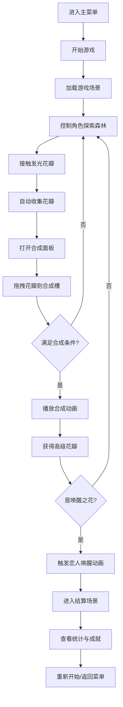

## 1. 产品概述

《梦境森林》是一款治愈系H5合成小游戏，玩家在梦幻森林中收集各类发光花瓣，通过合成更高级的花瓣来唤醒沉睡的恋人。游戏以唯美梦幻的视觉风格和舒缓的游戏节奏，为玩家带来沉浸式的情感体验。

- **核心玩法**：探索森林、收集花瓣、合成升级、唤醒恋人
- **目标用户**：喜欢治愈系、收集类、合成类游戏的休闲玩家
- **产品价值**：通过唯美的视觉表现和情感化的叙事，提供放松疗愈的游戏体验

## 2. 核心功能

### 2.1 用户角色
| 角色 | 说明 | 核心权限 |
|------|------|----------|
| 玩家 | 梦境森林中的探索者 | 控制角色移动、收集花瓣、合成操作、查看进度 |

### 2.2 功能模块
1. **主菜单场景**：开始游戏、继续游戏、音效设置
2. **游戏主场景**：森林探索、花瓣收集、角色控制
3. **合成系统**：花瓣合成、图鉴展示、进度追踪
4. **结算场景**：游戏通关、成就展示、重新开始
5. **存档系统**：自动保存、进度读取

### 2.3 页面详情
| 页面名称 | 模块名称 | 功能描述 |
|-----------|-------------|---------------------|
| 主菜单 | 标题区域 | 游戏标题动画、梦幻背景粒子效果 |
| 主菜单 | 按钮区域 | 开始/继续游戏按钮、音效开关按钮 |
| 游戏场景 | 森林背景 | 分层滚动视差效果、动态光影 |
| 游戏场景 | 角色控制 | 虚拟摇杆/点击移动、角色动画 |
| 游戏场景 | 花瓣收集 | 发光花瓣生成、自动吸附、收集动画 |
| 游戏场景 | UI面板 | 花瓣背包、合成按钮、进度条 |
| 合成界面 | 合成槽位 | 拖拽放置花瓣、合成动画特效 |
| 合成界面 | 花瓣图鉴 | 已收集花瓣展示、解锁进度 |
| 结算场景 | 恋人唤醒 | 唤醒动画、情感化文案展示 |
| 结算场景 | 统计面板 | 游戏时长、收集数量、成就展示 |

## 3. 核心流程

玩家进入游戏后，在梦境森林中控制角色移动，接触到发光花瓣时自动收集。收集一定数量的同类花瓣后，可以在合成面板中将低级花瓣合成为高级花瓣。当玩家收集并合成出最终的「唤醒之花」时，即可唤醒沉睡的恋人，触发通关结算。

## 4. 用户界面设计

### 4.1 设计风格

**色彩基调**：
- 主色：深紫色 `#1a0a2e`（梦境夜空）、森林绿 `#0d2818`
- 辅色：荧光粉 `#ff6b9d`、月光蓝 `#a8e6cf`、花瓣黄 `#ffe66d`
- 点缀色：发光白 `#ffffff`、星光金 `#ffd93d`

**视觉元素**：
- 背景：多层视差滚动的森林剪影，叠加星空粒子效果
- 角色：发光精灵形象，周身环绕微光粒子
- 花瓣：5种不同形态和颜色的发光花瓣，带有呼吸灯效
- UI：半透明玻璃拟态风格，圆角设计，带有柔和光晕

**字体选择**：
- 标题：使用艺术感衬线字体，营造梦幻氛围
- 正文：清晰易读的无衬线字体
- 强调文字：使用发光效果和渐变色

**动效设计**：
- 花瓣：缓慢旋转、上下漂浮、呼吸发光
- 角色移动：流畅的滑行动画，身后拖尾粒子
- 收集效果：花瓣飞向背包的贝塞尔曲线动画
- 合成效果：魔法阵光效、粒子爆发、花瓣蜕变

### 4.2 页面设计概述
| 页面名称 | 模块名称 | UI元素 |
|-----------|-------------|-------------|
| 主菜单 | 标题区域 | 居中游戏标题，渐变色+发光效果，背景缓慢漂浮的花瓣粒子 |
| 主菜单 | 按钮区域 | 垂直排列的圆角按钮，悬停放大+光晕效果，点击波纹反馈 |
| 游戏场景 | 森林背景 | 3层视差滚动：远景星空+中景森林剪影+近景草丛，整体缓慢移动 |
| 游戏场景 | 角色 | 发光小精灵，位于屏幕中央偏下，移动时有轨迹粒子 |
| 游戏场景 | 花瓣 | 随机生成在场景中，漂浮旋转，接近角色时自动吸附 |
| 游戏场景 | 底部UI | 半透明玻璃面板，显示各类花瓣数量，居中合成按钮 |
| 合成界面 | 合成区域 | 中央魔法阵，周围3个放置槽，拖拽花瓣时高亮提示 |
| 合成界面 | 图鉴区域 | 网格展示所有花瓣类型，已获得点亮，未获得灰色剪影 |
| 结算场景 | 唤醒动画 | 全屏光效，花瓣汇聚，恋人形象逐渐显现 |
| 结算场景 | 统计面板 | 卡片式布局，展示游戏数据，装饰性花瓣边框 |

### 4.3 响应式
- **设计原则**：以移动端H5为主要目标，采用移动优先设计
- **屏幕适配**：使用Phaser的ScaleManager进行自适应缩放，保持16:9游戏画面比例
- **触控优化**：虚拟摇杆区域增大，按钮最小尺寸44x44px，支持点击和拖拽操作
- **横屏支持**：同时支持横屏和竖屏显示，根据设备方向自动调整布局

### 4.4 游戏场景设计
- **环境氛围**：梦幻神秘的夜晚森林，月光透过树叶洒下斑驳光影
- **光影设置**：整体偏暗色调，发光元素作为视觉焦点，使用Additive混合模式实现发光效果
- **摄像机设置**：跟随角色移动，平滑缓动，边界限制
- **构图元素**：角色位于画面黄金分割点，UI元素分布在屏幕边缘，保持中央区域视野开阔
- **粒子系统**：持续生成的萤火虫粒子、花瓣飘落粒子、收集时的爆发粒子
- **后处理**：轻微的泛光效果（Bloom），增强梦境氛围
